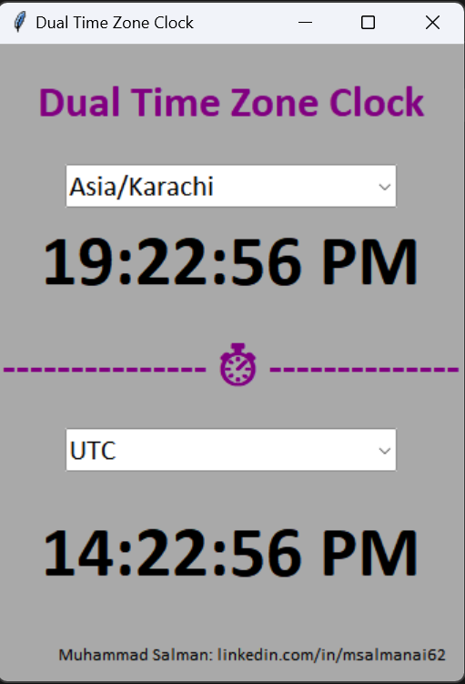

# Dual Timezone Clock using Python Tkinter
The clock file ***dual_tz_clock.exe*** is availabe in dist directory. Download and run file and it will start displaying double timezone time.🤗

here is screenhshot:

- We have used python tkinter library to make dual timezone clock.
- You do not need to install any other libary and file. Just download and run dual_tz_clock.exe to see dual timezone time on your screen.
- If you want to see or modify source code, it is available in ***clock.py*** file.
- I have tested this on just Windows OS. I am not sure about mac or other OS that it will work or not.
- You can select any timezone to see time of that timezone.
